# Streamhub QA assessment

**Paramjot Singh**<br>
[er.paramjots@gmail.com](mailto:er.paramjots@gmail.com)

This repo is a solution to Section B of the Streamhub Fullstack + QA Automation Assessment. It has a small loan API, Cucumber tests that call the API with Playwright, the two EMI calculator UI test cases, two SQL scenarios, and a self-healing locator exercise.

## Results at a glance

These results are from the last run on 6 October 2026.

| Section | Result | Report | Console log |
|---|---|---|---|
| B1. Build an API | 4 endpoints, sent from Postman | `postman/Loan-API.postman_collection.json` | |
| B2. API automation | 93 scenarios and 568 steps passed | <a href="https://param2596.github.io/streamhub-qa-assessment/reports/api-cucumber.html" target="_blank">reports/api-cucumber.html</a> | `reports/api-run-console.txt` |
| B3. UI test cases | 3 scenarios and 30 steps passed | <a href="https://param2596.github.io/streamhub-qa-assessment/reports/ui-cucumber.html" target="_blank">reports/ui-cucumber.html</a> | `reports/ui-run-console.txt` |
| B4. SQL tests | Scenario 1 returned 6 rows and scenario 2 returned 6, both matching the expected rows | `sql/results/` | `sql/results/scenario1.txt`, `sql/results/scenario2.txt` |
| Self-healing exercise | 5 scenarios failed on purpose, one per brittle locator | <a href="https://param2596.github.io/streamhub-qa-assessment/reports/self-healing-cucumber.html" target="_blank">reports/self-healing-cucumber.html</a> | `reports/self-healing-run-console.txt` |

The report links open the rendered pages. The images below are in `reports/screenshots/` and `sql/results/`.

### B1. Build an API

These requests come from the Postman collection and go to the API running locally.

A valid list request returns `200` with a page of loans.

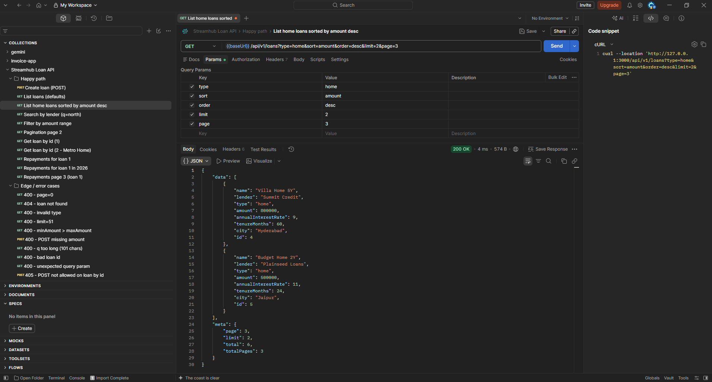

An invalid parameter returns `400` with the error code and field.

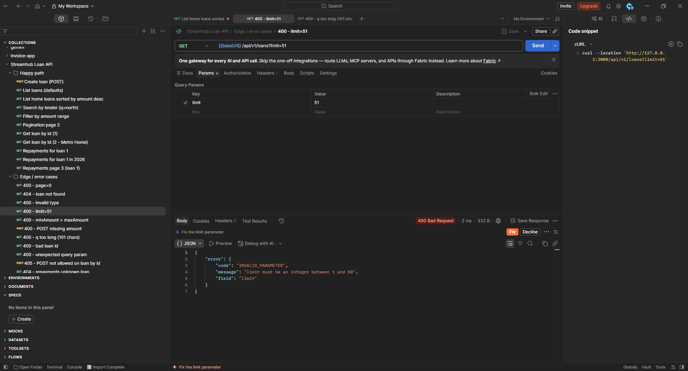

### B2. API automation

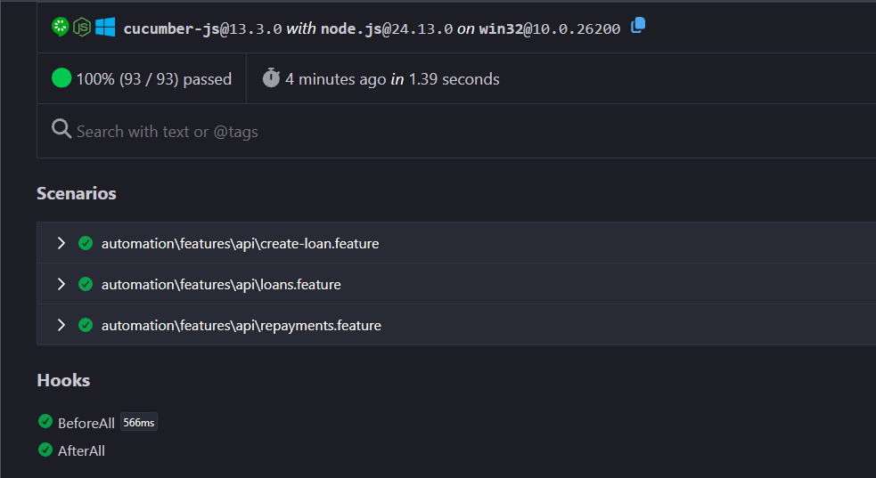

### B3. UI test cases

All 3 UI scenarios passed. The report lists files alphabetically, so the bar chart feature is above the pie chart feature. The tests ran the pie chart first.

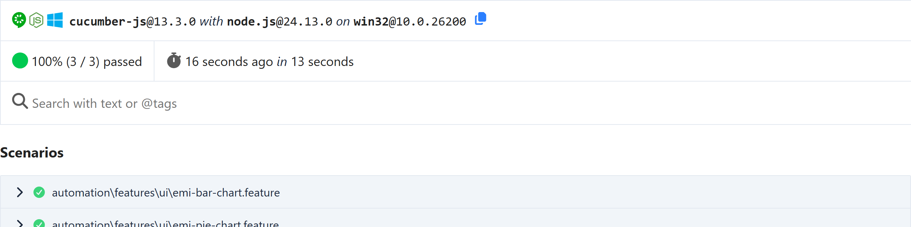

#### Test case 1, pie chart

Both examples passed. Each one checks the calculated EMI, that the pie chart is visible, and that both sections are greater than zero.

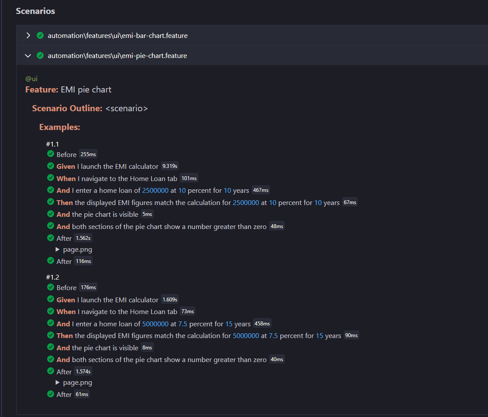

Scenario A is ₹25,00,000 at 10% for 10 years. The displayed EMI is ₹33,038.

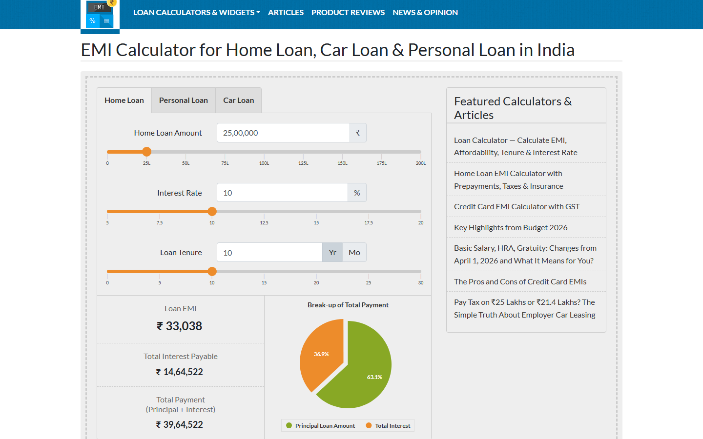

Scenario B is ₹50,00,000 at 7.5% for 15 years. The displayed EMI is ₹46,351.

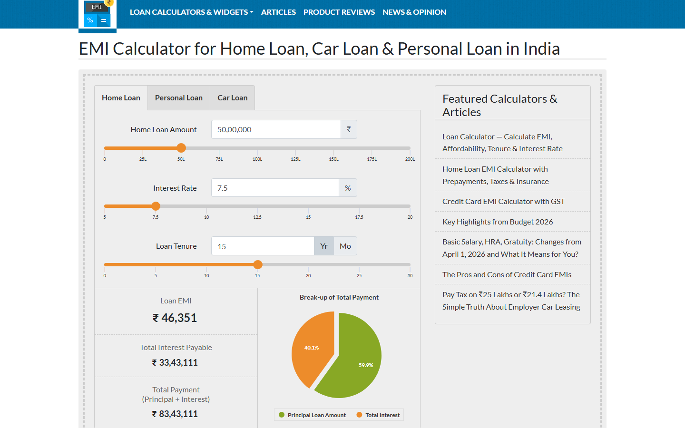

#### Test case 2, bar chart

The scenario passed. It sets the three sliders, changes the schedule month to January 2027, checks that the chart is visible, counts 10 bars, and checks one tooltip against the calculated schedule.

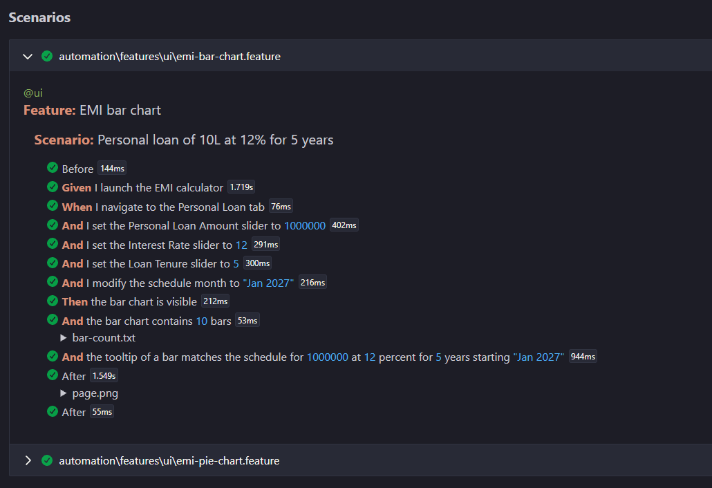

This is the bar chart after that run. The open tooltip is for 2031.

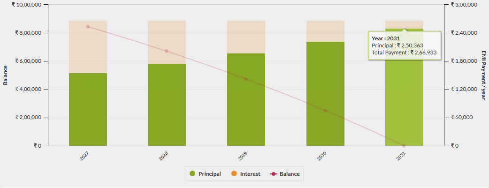

### B4. SQL tests

Scenario 1 finds round-trip transfers within 10% and 24 hours.

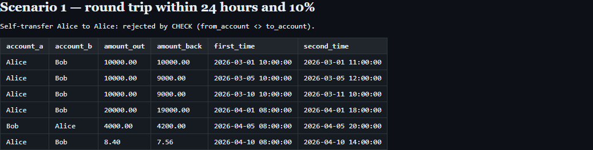

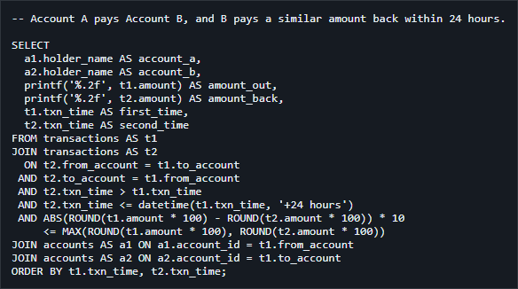

Scenario 2 finds streaks of 30 or more runs in at least three consecutive matches.

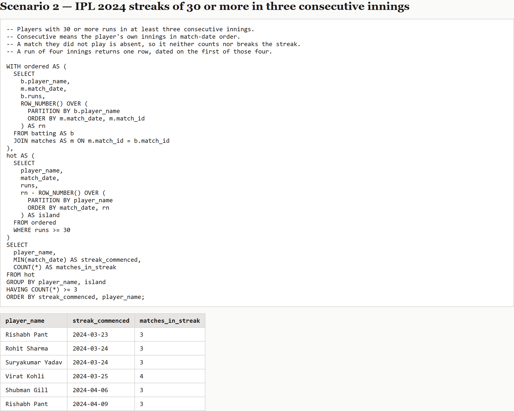

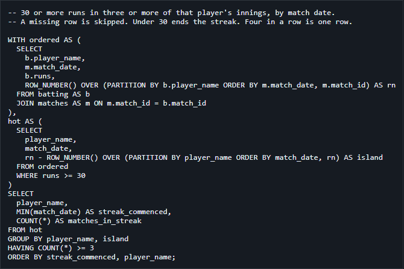

### Self-healing exercise

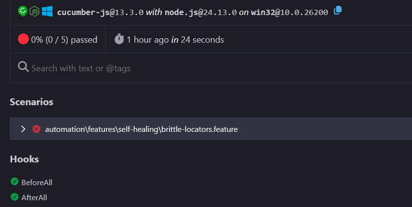

All five scenarios fail on their brittle locator, which is the intended result. The screenshot of each failure is in `reports/screenshots/`. The suggested replacements are in [reports/self-healing-suggestions.md](reports/self-healing-suggestions.md).

## Setup

You need Node.js 22.13 or newer. The SQL runner uses Node's built-in `node:sqlite`, which prints an experimental warning on Node 24.

```powershell
npm install
npx playwright install chromium
Copy-Item .env.example .env
```

`.env` is optional. Without it the API listens on `http://127.0.0.1:3000`, the API tests start a separate server on `http://127.0.0.1:3011`, and the UI tests open `https://emicalculator.net/`.

| Variable | Default | Used by |
|---|---|---|
| `API_PORT`, `API_BASE_URL` | `3000`, `http://127.0.0.1:3000` | `npm start` |
| `TEST_API_PORT`, `TEST_API_BASE_URL` | `3011`, `http://127.0.0.1:3011` | `npm run test:api` |
| `EMI_BASE_URL` | `https://emicalculator.net/` | UI, self-healing, and `suggest:locators` |
| `DEFAULT_PAGE`, `DEFAULT_LIMIT`, `MAX_LIMIT` | `1`, `10`, `50` | API pagination |

All URLs come from `config/env.ts`. Feature files, step definitions, and page objects contain no URLs.

## How to run

| Command | What it does | Output |
|---|---|---|
| `npm start` | Starts the loan API for Postman or a browser | `http://127.0.0.1:3000` |
| `npm run dev` | Starts the same API and restarts it when a file changes | |
| `npm run test:api` | Runs the Cucumber `@api` scenarios | `reports/api-cucumber.html` |
| `npm run test:ui` | Runs the Cucumber `@ui` scenarios against the live calculator | `reports/ui-cucumber.html` |
| `npm run test:self-healing` | Runs the five brittle locators. This run is expected to fail | `reports/self-healing-cucumber.html` |
| `npm run suggest:locators` | Checks replacement locators on the live calculator and writes the result. It does not edit the broken steps | `reports/self-healing-suggestions.md` |
| `npm run sql` | Builds the SQLite database, runs both queries, checks the rows, and screenshots the result tables | `sql/results/` |
| `npm run generate:repayments` | Rebuilds `src/api/data/repayments.json` from the loan file | |
| `npm run typecheck` | Runs `tsc --noEmit` | |

The API tests do not use the server on port 3000. They start their own process on `TEST_API_PORT` and stop it when the run finishes.

GitHub Actions runs `npm run typecheck`, `npm run test:api`, `npm run test:ui`, and `npm run sql` on every push to `main`.

To try the API by hand, run `npm start` and import `postman/Loan-API.postman_collection.json` into Postman.

## Architecture

```
src/api/            Express app, Zod validation, in-memory catalog
src/domain/         EMI formula and repayment schedule
src/api/data/       loans.json seed, repayments.json generated
automation/
  features/         Gherkin feature files: api, ui, self-healing
  steps/            Step definitions
  pages/            Page objects: EmiCalculatorPage, LoansApi, RepaymentsApi
  support/          Cucumber world, hooks, assertions, display EMI math
config/             Environment variables and project root
sql/                Schema, seed data, queries, results
scripts/            SQL runner, locator suggestions, repayment generator
docs/               Self-healing write-up
postman/            Postman collection
reports/            Cucumber reports and console logs
```

Cucumber runs the tests from `cucumber.js`. Playwright launches Chromium for the UI scenarios and sends the API requests. Step definitions call page objects. The UI steps contain no selectors. The API page objects wrap each endpoint, so steps never build URLs.

`cucumber.js` keeps the feature paths and TypeScript loading on the `default` profile. Each npm script passes `--profile default` and a named profile such as `--profile api`, because a named profile does not inherit `default` on its own.

### Loan API

| Method | Path | Behavior |
|---|---|---|
| `GET` | `/api/v1/loans` | Filters, sorts, and paginates loans |
| `POST` | `/api/v1/loans` | Creates a loan and its schedule, returns `201` |
| `GET` | `/api/v1/loans/:id` | Returns one loan, or `404` |
| `GET` | `/api/v1/repayments` | Returns schedule rows. `loanId` is required |

The list filters are `type`, `q`, `minAmount`, `maxAmount`, `sort`, `order`, `page`, and `limit`. `type` is `home`, `personal`, or `car`, and the match ignores case. `q` matches the name or the lender. `/repayments` also accepts `year`. The default page size is 10 and the maximum is 50. An invalid value returns `400` with the field name. An unknown query key returns `400`. The wrong method on a known path returns `405`, and an unknown path returns `404`.

Every error has the shape `{ "error": { "code", "message", "field?" } }`.

`POST` keeps the new loan in memory only, so a restart drops it. The body cannot include `id`. The seed file has loans 1 to 18. Schedules start in January 2026. Each row stores principal, interest, EMI, and remaining balance in rupees to two decimal places, and the last month clears the balance.

The API tests cover a happy path for each endpoint and parameter, combinations of parameters, pagination past the end, out-of-range and wrong-type values, missing required parameters, unknown parameters, wrong methods, and malformed `POST` bodies. Each check asserts the status code and the response shape.

### EMI figures

The calculator and the API both use `E = P * r * (1 + r)^n / ((1 + r)^n - 1)`, with `r = annual / 12 / 100`.

The tests compute the expected figures in `automation/support/emi.ts` and compare them with the page. The summary on the website rounds the monthly EMI to the nearest rupee. Total payment is `round(raw EMI × months)`. Interest is total payment minus principal. The bar tooltip does not use the rounded monthly EMI. Its yearly interest and total are the raw EMI summed for the year, then rounded. The tooltip check allows a difference of 1 rupee.

### UI scenarios

- Test case 1 is the Home Loan pie chart, with two examples. They are ₹25,00,000 at 10% for 10 years and ₹50,00,000 at 7.5% for 15 years. The displayed EMI, interest, and total must match the calculation. The pie chart must be visible, and both of its sections must be greater than zero.
- Test case 2 is the Personal Loan bar chart. The test drags the three sliders to ₹10,00,000, 12%, and 5 years, then sets the schedule month to January 2027 in the calendar. The bar chart must be visible and must have 10 column bars. The tooltip of one bar must match that year's interest, principal, and total from the calculated schedule.

The tabs, the amount, rate, and tenure fields, the year radio, the schedule field, the EMI headings, the calendar, and the chart roots use role, label, or text locators. Two widget internals do not, because the live page gives them no role and no accessible name.

- The slider handle is `#${inputId}slider` plus `.ui-slider-handle`. `getByRole("slider")` matches nothing on this page.
- The bars and the tooltip are Highcharts nodes inside the bar-chart image. The count excludes legend swatches. The tooltip hover uses the tallest column, not `.first()`.

The UI tests run against the live site. Highcharts redraws a chart after an input changes, so the page object retries the scroll and the tooltip hover. The browser context aborts requests to known ad hosts before the page loads.

### SQL

`npm run sql` creates a SQLite database and runs the files in `sql/`. `sql/schema.sql` has the tables, `sql/seed.sql` has the data and a comment on each case, and the two query files contain the queries. The runner checks the returned rows against the expected rows before it writes the screenshots.

Scenario 1 returns a payment and the payment back when the amounts are within 10% and the times are within 24 hours. `account_a` is whoever paid first. A gap of exactly 10% counts, and so does a gap of exactly 24 hours. The query compares amounts in whole paise, so 8.40 and 7.56 count as exactly 10% apart. The seed also includes an 11% gap, a gap of 24 hours and one minute, and a payment that continues to a third account. The query leaves those out. A check constraint rejects a transfer from an account to itself.

Scenario 2 returns each player with 30 or more runs in at least three consecutive matches, with the date the streak started. The query numbers each player's innings with `ROW_NUMBER()` and groups the runs of 30 or more into streaks. "Consecutive" here means the player's own consecutive matches, so a match the player did not play does not break the streak. A score under 30 does break it. A streak of four matches is one row, dated on its first match. The extra `matches_in_streak` column shows why each row qualified.

The brief could also mean the team's consecutive matches. Under that reading, Suryakumar Yadav's row would drop out, because he missed MI's match on 2024-03-28. The seed data includes that case on purpose.

### Self-healing

`automation/steps/self-healing/brittle.steps.ts` has five locators that are wrong on purpose. They are a positional CSS path, an absolute XPath, an SVG `nth-child` path, a Highcharts series index, and the untouched default text `₹ 44,986`. `npm run test:ui` does not run them, and nothing replaces them.

[docs/self-healing-locators.md](docs/self-healing-locators.md) explains how to detect a locator failure, the prompt that asks for a replacement, and the checks to run before applying a fix. `npm run suggest:locators` is the working example. It opens the live calculator, checks each replacement, and writes [reports/self-healing-suggestions.md](reports/self-healing-suggestions.md). It confirms that `brittle.steps.ts` is unchanged afterwards.

## AI / Cursor reflection

I used Cursor Pro as my pair programmer for the whole project. The brief names Claude Code but allows any similar AI tool.

### How I used it

- I gave it the assessment PDF and asked for a plan for Section B that covered every requirement. Before it planned the UI tests, it opened the live calculator and looked at the tabs, fields, and charts.
- I described the framework I wanted. It set up the folders, the Express and Zod API, the JSON data, the page objects, the step definitions, and the config.
- I built the rest with it one step at a time. I asked how the API was structured, whether it had pagination, and how to test it in Postman. Then I asked it to add `POST`, cover every B3 step, add the bar count and tooltip checks, move the tests to Cucumber, and write the self-healing exercise.
- I used it to learn the parts that were new to me. Those were Cucumber profiles and hooks, the window-function approach for the SQL streak, reading Highcharts SVG, and self-healing locators.
- I used it as a reviewer. Twice I asked it to grade the repo against the brief the way a Streamhub evaluator would. Both reviews found problems, and they are listed below.

### What worked

- The plan tied each line of the PDF to a file, so nothing in Section B was left out.
- The first version of the API ran on day one. It had three endpoints, validation that names the bad field, and a generated repayment schedule.
- It wrote 93 API scenarios, including boundary values such as `page=1000001`, `limit=51`, a 101-character `q`, and malformed JSON.
- It checked the live page before choosing locators. That is how it found that the slider handle has no role, and that the chart's accessible name starts with "Created with Highcharts". It also found that the chart has 12 points but only 10 real bars, and that the tooltip uses the unrounded EMI.
- The SQL streak query uses `ROW_NUMBER()` to group consecutive innings. The SQL runner checks for the exact expected rows, so a wrong query fails before it writes any screenshot.
- The self-healing proof of concept tries each suggested locator on the live page instead of trusting the model's answer.

### What did not work, and what I corrected

Its first answer was often the wrong approach, and I had to steer it back to the brief many times. Everything in this list is fixed in the current code.

- The first API was read-only. It said `POST` was not needed, because the brief only asks for an API that returns data. I asked for a simple create endpoint. Created loans stay in memory, so the list checks that don't filter by type expect at least 18 loans, not exactly 18.
- For B3 I told it to ask before adding anything. It covered the two test cases but left out the self-healing exercise, the expected bar count, and the tooltip check against the schedule. It offered them as optional extras, even though the brief asks for them. I asked for all three.
- It first used playwright-bdd, which turns Gherkin into Playwright tests. The brief names Cucumber, so I asked for `@cucumber/cucumber`. Its first Cucumber command passed only `--profile api` and found 0 scenarios, because that profile doesn't inherit the feature paths from `default`.
- Locators took three rounds. First it agreed with a review that the chart ids and Highcharts classes were "the best available". Then it said nothing outside the self-healing file was brittle. I pointed at `emi-calculator.page.ts`, which still used a parent step, `.first()`, datepicker classes, and chart ids. Its next pass removed the positional selectors but kept CSS. I asked again for role, label, and text locators, and that pass moved the calendar, the headings, and the charts over.
- Its first draft of this reflection listed the problems but never named the tool, and the brief asks for that.
- The first evaluator review found problems the earlier passes missed. `hooks.ts` built the test API URL instead of reading it from `config/env.ts`. The profile check started the API server during UI runs. The console logs had PowerShell error text and a dotenv banner. The last UI run then failed on the live site because Highcharts redrew the chart.
- SQL Scenario 1 checked the 10% and 24-hour limits with decimal division. I asked whether the decimals could drift at the exact limits. The 24-hour check held up in testing, but the 10% check did not. It rejected 2,292 of 5,406 pairs that were exactly 10% apart with paise amounts, such as 8.40 and 7.56. The query now compares whole paise, and the seed data includes that case.
- Scenario 1 also did more than the brief asked. It returned percent and hours columns and used six `CASE` lines to order each pair. I asked it to answer only the question, and the query is now a single join.
- The README and `package.json` said Node 20, but `node:sqlite` needs Node 22.13 or newer. I caught the mismatch, and both now say 22.13.
- It wrote a script that only captured report images for this README. That isn't testing, so I removed it.
- A second evaluator review found more. The bar chart screenshot cut off the bottom of the graph, and the first fix put a locator in `hooks.ts` instead of the page object. `npm run typecheck` skipped the test code. No repayments test combined `year` with `page` and `limit`.
- Ads on live site were causing test failures, so added blocking of ad sites in browsercontext.

### Problems found while making those fixes

- SVG nodes have no `innerText`, so the tests read the pie labels and the tooltip from `textContent`. That text runs together, for example `2027Interest`, so a word-boundary regex never matched the series name.
- Counting every `.highcharts-point` returned 12, which is 10 columns and 2 legend swatches. Calling `evaluateHandle` on the bar locator failed strict mode, because that locator matches every column. The handle now comes from the chart root.
- Rounding the monthly EMI first matches the summary on the page. The tooltip sums the unrounded EMI, so it differs from that by a few rupees.
- `getByRole("img", { name: /Break-up of Total Payment/ })` matched nothing, because the image's accessible name starts with "Created with Highcharts". Filtering `getByRole("img")` by the visible text works.
- `getByRole("heading", { name: "Loan EMI" })` matched two headings. The name match is a substring, and the page also has "Home Loan EMI Calculator". The test uses `/^Loan EMI$/`.
- Zod would not accept both `required_error` and a custom error map on the loan type enum, and the server crashed on startup until I removed `required_error`. An unknown JSON key such as `id` reported no field name, because Zod leaves `path` empty for that issue. The handler reads `issue.keys` instead.
- The Home Loan page also has the bar chart further down. Checking whether that chart exists would have screenshotted the bar chart for the pie scenarios too. The page object now records when a bar chart step runs and only then screenshots the chart.
- Port 3000 was already in use on my machine. The API tests use their own port, 3011, so they never connect to a server someone else started.
